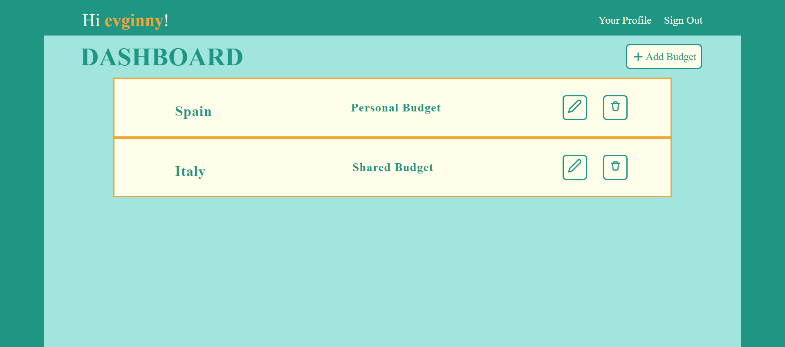

# Vaqay
Made by [Evgeniya Kalashnikova a.k.a. Ginny](https://github.com/Nick-Pena), [Nicholas Pena](https://github.com/Nick-Pena) & [Yelena Trunina](https://github.com/ytrunina).

<!--  -->
## Project Description:
Our project aims to simplify the process of budgeting and expense management for travelers, particularly those traveling in large groups. We are developing a collaborative web application that provides a user-friendly platform for creating, managing, and analyzing travel budgets. The application will facilitate the division of costs among group members and enable real-time tracking of transactions to ensure adherence to the budget.

## Features:
### Budget Creation:
Users will have the ability to create a comprehensive budget for their trip. They can specify the total amount they plan to spend and allocate funds to different categories such as transportation, food, and activities. This feature allows users to set clear financial goals and plan their expenses accordingly.
### Transaction Tracking:
Our application enables users to log their transactions in real time. Whether it's expenses related to accommodation (e.g., Airbnb), transportation (e.g., gas, flights), or other expenditures, users can easily record and track their transactions. This feature provides users with a clear overview of their spending and helps them make informed decisions to stay within their budget.
### User Management:
The application allows users to manage their personal information and change their passwords as needed. This feature ensures that users have control over their account details and can maintain the security of their information.
### Collaborative Budgeting:
In addition to individual budget management, our application supports collaboration among group members. Users can invite others to join a shared budget, enabling seamless coordination and division of expenses. This feature promotes transparency and eliminates the need for manual calculations or tracking of shared costs.

